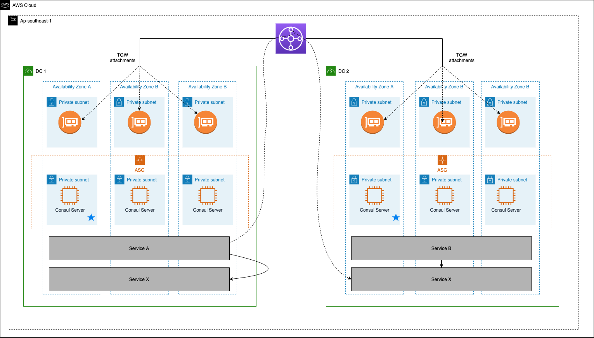
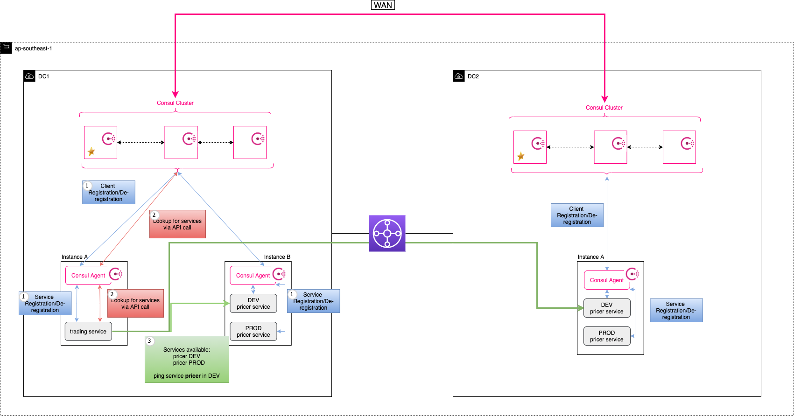
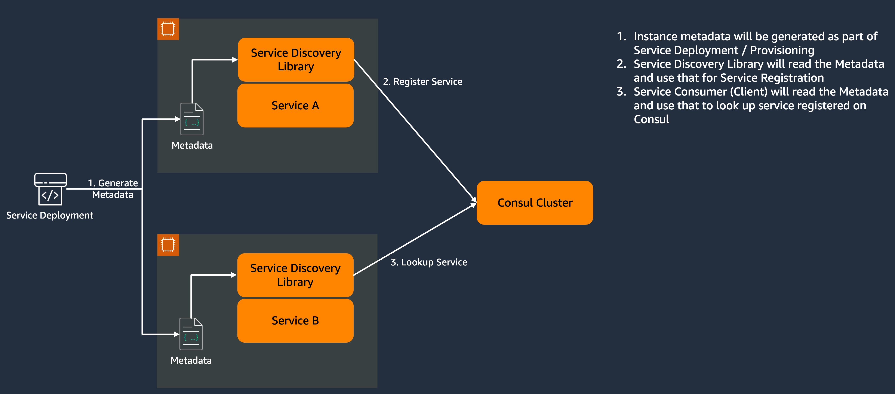
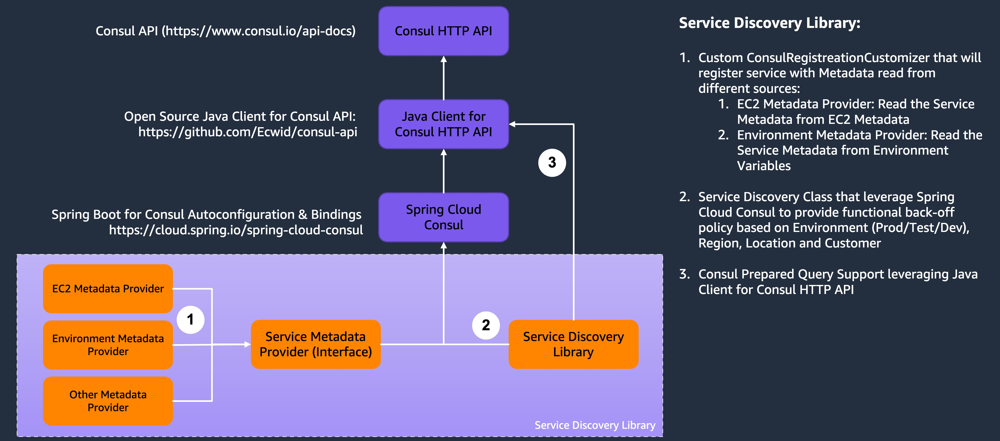

## Deployment Guide

- [Deployment Guide](#deployment-guide)
  - [Introduction](#introduction)
  - [Pre-requistes](#pre-requistes)
    - [Consul licensing](#consul-licensing)
    - [Packages/Tools](#packagestools)
  - [Solution overview](#solution-overview)
    - [Infrastructure](#infrastructure)
    - [Consul cluster / Consul Agent (running in server mode)](#consul-cluster--consul-agent-running-in-server-mode)
    - [Sample SpringBoot Web-App / Consul Agent (running in client mode)](#sample-springboot-web-app--consul-agent-running-in-client-mode)
    - [Service Discovery Library](#service-discovery-library)
  - [Build \& Run the Sample App (dev / local setup) for local testing](#build--run-the-sample-app-dev--local-setup-for-local-testing)
  - [Prod Setup](#prod-setup)
    - [Prerequisites (dev / local setup)](#prerequisites-dev--local-setup)
    - [Build the Sample App (dev / local setup)](#build-the-sample-app-dev--local-setup)
    - [Run the Sample App (dev / local setup)](#run-the-sample-app-dev--local-setup)
  - [Deploying / Getting started](#deploying--getting-started)
    - [1. AWS CLI setup](#1-aws-cli-setup)
    - [2. Build Consul Server AMI](#2-build-consul-server-ami)
    - [3. Build Consul Client AMI](#3-build-consul-client-ami)
    - [4. Infrastructure pre-deployment steps](#4-infrastructure-pre-deployment-steps)
    - [5. Infrastructure deployment steps](#5-infrastructure-deployment-steps)
    - [6. Infrastructure post-deployment steps](#6-infrastructure-post-deployment-steps)
  - [Test your deployment](#test-your-deployment)
  - [Build your own](#build-your-own)

### Introduction

This guide describes all the required steps to deploy the assets of the eFX PoC.

The goal of the eFX POC is to demonstrate service discovery capability in a multi-datacenter environment.
This PoC consists of the following components:

- AWS Services for base infrastructure
- Hashicorp's Consul as networking platform
- A sample SpringBoot web-app
  - Service Discovery Library uses a custom algorithm to discover a service that matches a set of predicates and is nearest to the source service

### Pre-requistes

#### Consul licensing

This POC solution requires you to have a valid Consul enterprise license to successfully deploy the assets.

#### Packages/Tools

In order to execute this deployment, please ensure you have installed the following packages on the machine from which you're deploying Terraform:

- packer@latest - to build the Consul AMI that will be used to deploy the PoC
- terraform@latest - to deploy the PoC
- aws-cli@latest and configured - to use System Manager

### Solution overview

#### Infrastructure

This PoC is made of two datacenters represented by two VPCs, and interconnected by a Transit Gateway for networking purposes.



#### Consul cluster / Consul Agent (running in server mode)

In each datacenter (VPC) there is a Concul cluster deployed which consists of 3 EC2 instances, each EC2 instance is running Consul in server mode. The EC2 instances are part of an auto-scaling group for resilience purposes.



#### Sample SpringBoot Web-App / Consul Agent (running in client mode)

The sample web-app and the consul agent (running in client mode) are deployed in EC2 intance.

The sample web-app, during boot up, will retrieve metadata from the EC2 Metadata Service and will register in consul. Below you can see a high level diagram of the service registration process.


The service registration with EC2 metadata is achieved by providing a custom metadata provider to Spring Cloud Consul plugin that retrieves metadata from the EC2 Metadata Service. This is an extensible mechanism and can be used to build other custom metadata providers with ease. The plugin makes use of the open source Java [consul-api](https://github.com/Ecwid/consul-api) library which in turn interacts with the consul agent via HTTP. This flow is depicted at the diagram below.


#### Service Discovery Library

Additionally, for service disocvery we build a Service Discovery Library which makes use of the Java open source library mentioned above to interact with the consul-agent.

The service discovery algorithm makes use of four predicates (this is the metadata retrieved from the EC2 Metadata Service):◊

- environment
- customer
- cluster
- location (this predicate is not used as we first check for services in the same DC as the source service)

For instance if a service called 'trading-engine' with metadata[customer: ACME, cluster: ALPHA, environment: DEV] wants to discover a service called 'pricer' the algorithm will perform the following steps:

1.  GET all knows DCs from consul
    - The result is a list of DCs ordered in increasing TTL order from the source service
2.  For each DC
    - GET all services that match the serviceName 'pricer'
    - FOR each service
      - IF CUSTOMER, CLUSTER, ENVIRONMENT predicates match
        - store the result in a FULL_MATCH_LIST
      - IF CUSTOMER, ENVIRONMENT predicates match
        - store the result in a CUSTOMER_MATCH_LIST
      - IF SHARED CUSTOMER, ENVIRONMENT predicates match
        - store the result in a SHARED_CUSTOMER_LIST
    - IF there are records in FULL_MATCH_LIST
      - Return the FULL_MATCH_LIST and Exit
    - Else continue to the next DC in the list
3.  If there are records in CUSTOMER_MATCH_LIST (At this point the algorithm has gone through all DCs.)
    - Return CUSTOMER_MATCH_LIST
    - Else Return SHARED_CUSTOMER_LIST

### Build & Run the Sample App (dev / local setup) for local testing

The sample app has been developed using the below libraries

- Java 11
- Spring Boot 2.7.3
- Maven 3.8.6

### Prod Setup

To deploy the sample app to production, copy the jar named `efx-0.0.1-SNAPSHOT.jar`,which was shared as part of the assets, to this directory `~/deployment/`. When terraform runs it will pick up the jar and copy it over to an S3 folder. From there on the jar starts up by the user-data script.

Alternatively, you can build the jar as well following the instructions below.

#### Prerequisites (dev / local setup)

To successfully run the sample app locally you need to download the consul binary and run it using the command shown below. The consul agent will run on port 8500 by default. The sample app uses port 8500 to communicate with the agent and register / deregister.

```
consul agent -dev
```

#### Build the Sample App (dev / local setup)

To build the project and create an executable jar, navigate to the directory `efx/` and run the following command. This will create a jar with name `efx-0.0.1-SNAPSHOT.jar` in `target/` directory.

```
mvn package
```

#### Run the Sample App (dev / local setup)

To run the sample app as Trading engine execute the following command:

```
java -jar -Dspring.profiles.active=trading efx-0.0.1-SNAPSHOT.jar
```

To run the sample app as Pricer execute the following command:

```
java -jar -Dspring.profiles.active=pricer efx-0.0.1-SNAPSHOT.jar
```

To run the sample app as Static Data Service execute the following command:

```
java -jar -Dspring.profiles.active=static-data efx-0.0.1-SNAPSHOT.jar
```

### Deploying / Getting started

#### 1. AWS CLI setup

Please ensure that you have set up your aws-cli config with the correct credentials.

To setup your aws-cli run the following command:

```
aws configure
```

Alternatively you can manually modify the following files:

`~/.aws/config`

`~/.aws/credentials`

#### 2. Build Consul Server AMI

Go to `~/deployment/scripts/amis/consul-server/` directory and build the AMI by running:

```
packer build .
```

Once ran, the AMI ID output will be shown, write it down somewhere since you will need it to deploy your Terraform files.

The output will like this:

```
==> Builds finished. The artifacts of successful builds are:
--> amazon-ebs.ubuntu20-ami: AMIs were created:
ap-southeast-1: ami-xxxxxxxxxxxxxxxxxx
```

You can also find the newly built AMI into your AWS account.

#### 3. Build Consul Client AMI

Go to `~/deployment/scripts/amis/consul-client/` directory and build the AMI by running:

```
packer build .
```

Once ran, the AMI ID output will be shown, write it down somewhere since you will need it to deploy your Terraform files.

The output will like this:

```
==> Builds finished. The artifacts of successful builds are:
--> amazon-ebs.ubuntu20-ami: AMIs were created:
ap-southeast-1: ami-xxxxxxxxxxxxxxxxxx
```

You can also find the newly built AMI into your AWS account.

#### 4. Infrastructure pre-deployment steps

Since Terraform will deploy the whole infrastructure at once, there are a few pre-requisites to complete before the deployment.

1. Edit variables.

Navigate to directory `~/deployment/` and edit the variable file _`template.var.tfvars.json`_ and input your variables values, including the AMI IDs built in section 1.

**_Note: The key pair name should be entered without its extension .pem._**

1. Place the application file .jar in the root folder of deployment `~/deployment/`.

#### 5. Infrastructure deployment steps

To deploy the PoC, run the following:

```
export VAR_FILE=template.var.tfvars.json
```

```
terraform init && terraform plan --var-file=$VAR_FILE -out plan.out
```

```
terraform apply plan.out
```

#### 6. Infrastructure post-deployment steps

1. Check that Consul clusters are up, running, and WAN connected.

Since the EC2 instances have been deployed with system manager access, you can ssh into the instances via system manager. Go to the EC2 tab, select one of the cluster instances (i.e. consul-server-dc1), click Connect then go to Session Manager tab to connect.

Once connected, run:

```
consul members
```

This will show you the list of servers and clients inside this datacenter.

Now run:

```
consul members -wan
```

This will show you the list of consul servers across all the available datacenters of this deployment, meaning DC1 and DC2 here.

2. Check that all services (trading, pricer, static-data) are running.

If you have private conectivity in place to the instances, then pick one of the consul server private IP address, open your browser and type <privateIP>:8500/ui.

This will give you access to the Consul UI where you can see all the services registered in both datacenters DC1 and DC2.

If you do not have private connectivity to the instances, you can use System Manager. First, you will need to install System Manager Plugin, as explained [here](https://docs.aws.amazon.com/systems-manager/latest/userguide/session-manager-working-with-install-plugin.html).

Then from the terminal you ran Terraform, run the following by providing a value for `--target i-xxxxxxxxxxxxxx` and region `--region ap-southeast-1`

```
aws ssm start-session --target <instanceID> --document-name AWS-StartPortForwardingSession --parameters '{"portNumber":["8500"],"localPortNumber":["8500"]}' --region <region>
```

Finally, open your browser and connect to localhost:8500/ui. You will need to provide the token management ID in order to login to the UI. This token has been generated during the deployment, you can find it in Secrets Manager on the AWS console.

### Test your deployment

Connect to the trading instance and query the different services:

```
curl http://localhost:9090/v1/discover/service/pricer
```

```
curl http://localhost:9090/v1/discover/service/static-data
```

The below table describes all the services that have been setup during this deployment, and the order of precendence for each of them. This deployment considers that the trading service will be the one querying both pricer and static-data services that will then be returned based on the order of priority as below.

| Service     | Precedence | Customer | Cluster | Location | Environment |
| ----------- | ---------- | -------- | ------- | -------- | ----------- |
| TRADING     | 1          | ACME     | ALPHA   | DC1      | DEV         |
|             |            |          |         |          |             |
| PRICER      | 1          | ACME     | ALPHA   | DC1      | DEV         |
| PRICER      | 2          | ACME     | ALPHA   | DC2      | DEV         |
| PRICER      | 3          | ACME     | BETA    | DC1      | DEV         |
| PRICER      | 4          | ACME     | BETA    | DC2      | DEV         |
| PRICER      | 5          | SHARED   | ALPHA   | DC1      | DEV         |
| PRICER      | 6          | SHARED   | ALPHA   | DC2      | DEV         |
|             |            |          |         |          |             |
| STATIC-DATA | 1          | SHARED   | SHARED  | DC1      | DEV         |
| STATIC-DATA | 2          | SHARED   | SHARED  | DC2      | DEV         |
| STATIC-DATA | 2          | SHARED   | BETA    | DC2      | DEV         |
| STATIC-DATA | 2          | SHARED   | GAMMA   | DC2      | DEV         |
| STATIC-DATA | -1         | STARK    | ALPHA   | DC1      | DEV         |
| STATIC-DATA | -1         | ACME     | BETA    | DC2      | PROD        |

In order to test this table, you can switch on and off instances to verify where the traffic is being redirected to. The algorithm is based on the EC2 metadata and EC2 tags are configured as part of the EC2 terraform deployment.

### Build your own

If adding your own services and algorithm, you will need to change the EC2 metadata accordingly. The way to do it is to change the instance local block in the **`ec2.tf`** file in `modules/infra`. Each service is stated in there with its own tags, that will be loaded during the EC2 instance deployment and that will serve to the algorithm when EC2 metadata will be queried.
You should only edit this block of configuration, the EC2s deployment is automated based on this local block, and so each instance stated in this list will be deployed.


## Security

See [CONTRIBUTING](CONTRIBUTING.md#security-issue-notifications) for more information.

## License

This library is licensed under the MIT-0 License. See the LICENSE file.

